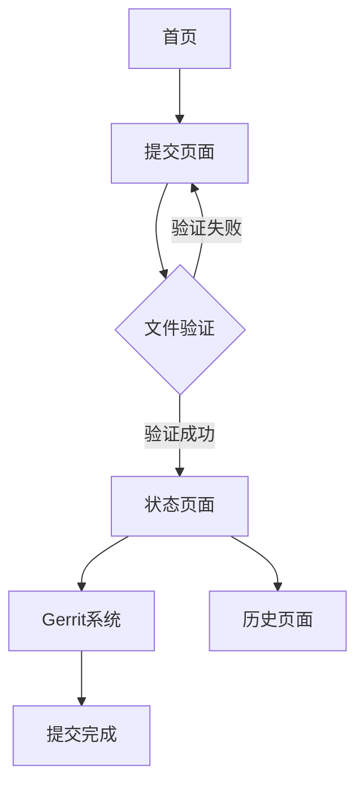

## 1. Product Overview
AOSP Patch提交Web服务是一个简化Android开源项目(AOSP)代码贡献流程的在线平台。用户可以通过直观的Web界面上传Git patch文件，系统自动验证格式并提交到Google AOSP Gerrit进行代码审查，大大降低了参与AOSP开发的门槛。

该服务主要解决开发者向AOSP提交patch时的技术复杂性，让任何开发者都能轻松参与Android开源项目贡献。

## 2. Core Features

### 2.1 User Roles
| Role | Registration Method | Core Permissions |
|------|---------------------|------------------|
| Anonymous User | 无需注册 | 上传patch文件，查看提交状态 |
| Authenticated User | Google OAuth登录 | 查看历史提交记录，管理个人patch |

### 2.2 Feature Module
AOSP Patch提交服务包含以下核心页面：
1. **首页**: 服务介绍，文件上传区域，使用说明。
2. **提交页面**: patch文件上传，项目选择，提交信息填写。
3. **状态页面**: 提交进度显示，Gerrit链接，结果反馈。
4. **历史页面**: 提交记录查看，状态追踪。

### 2.3 Page Details
| Page Name | Module Name | Feature description |
|-----------|-------------|---------------------|
| 首页 | 服务介绍 | 显示AOSP Patch提交服务的功能说明和使用流程。 |
| 首页 | 快速上传 | 提供文件拖拽上传区域，支持.patch和.diff格式。 |
| 首页 | 使用指南 | 展示如何生成patch文件和填写提交信息的教程。 |
| 提交页面 | 文件上传 | 支持拖拽或点击选择patch文件，实时验证文件格式。 |
| 提交页面 | 项目选择 | 下拉选择目标AOSP项目（如frameworks/base、packages/apps/Settings等）。 |
| 提交页面 | 提交信息 | 填写commit message、change description等必要信息。 |
| 提交页面 | 验证反馈 | 实时显示文件验证结果，包括格式检查和大小限制。 |
| 状态页面 | 进度显示 | 实时显示patch提交进度：上传中→验证中→提交中→完成。 |
| 状态页面 | 结果展示 | 显示Gerrit change链接、change-id、审核状态。 |
| 状态页面 | 错误处理 | 友好的错误提示和重试建议。 |
| 历史页面 | 提交记录 | 显示用户所有patch提交历史，包括时间、状态、链接。 |
| 历史页面 | 状态追踪 | 实时更新每个patch在Gerrit中的审核状态。 |

## 3. Core Process
### 用户提交流程
1. 用户访问首页，了解服务功能和操作流程
2. 在提交页面上传patch文件，系统自动验证格式
3. 选择目标AOSP项目和填写提交信息
4. 系统处理patch并提交到Gerrit
5. 显示提交结果和Gerrit链接

## 4. User Interface Design
### 4.1 Design Style
- **主色调**: Android绿色 (#3DDC84) 搭配白色背景
- **辅助色**: Material Design蓝色 (#1976D2) 用于按钮和链接
- **按钮样式**: Material Design风格，圆角矩形，带有阴影效果
- **字体**: Roboto字体族，标题18-24px，正文14-16px
- **布局风格**: 卡片式布局，居中显示，最大宽度1200px
- **图标风格**: Material Design图标，简洁线性风格

### 4.2 Page Design Overview
| Page Name | Module Name | UI Elements |
|-----------|-------------|-------------|
| 首页 | 服务介绍 | 顶部横幅使用Android绿色渐变背景，白色文字标题，简洁的图标说明。 |
| 首页 | 快速上传 | 中央大卡片，虚线边框拖拽区域，Android机器人图标，支持文件拖拽。 |
| 提交页面 | 文件上传 | 左侧文件预览区域，右侧表单区域，Material Design输入框和下拉菜单。 |
| 状态页面 | 进度显示 | 顶部进度条，中央状态图标（加载中/成功/失败），底部详细信息卡片。 |
| 历史页面 | 提交记录 | 时间线布局，每个记录显示状态图标、时间、项目名和Gerrit链接。 |

### 4.3 Responsiveness
- **桌面优先**: 针对1920x1080桌面端优化设计
- **移动端适配**: 支持768px以上平板和移动设备
- **触摸优化**: 按钮和交互元素最小44px触摸区域
- **加载优化**: 渐进式加载，优先显示核心内容