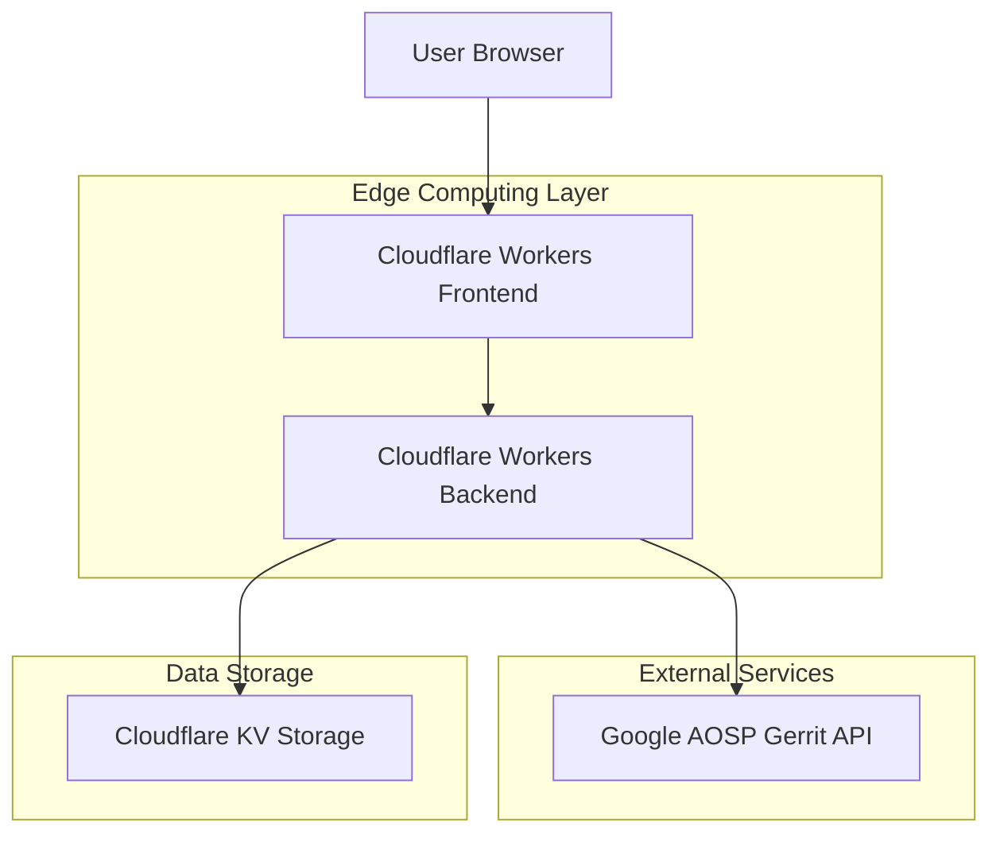
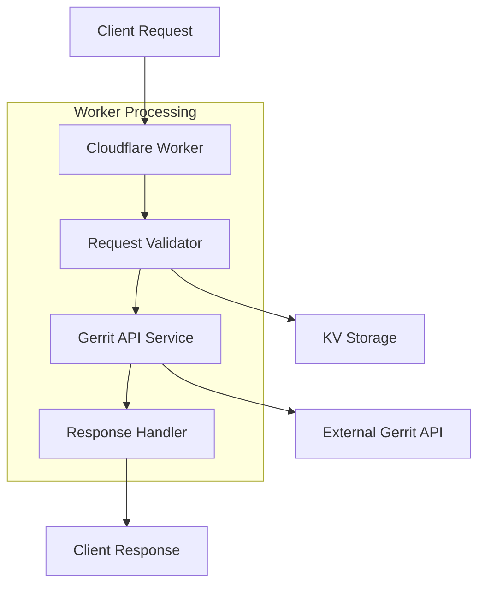
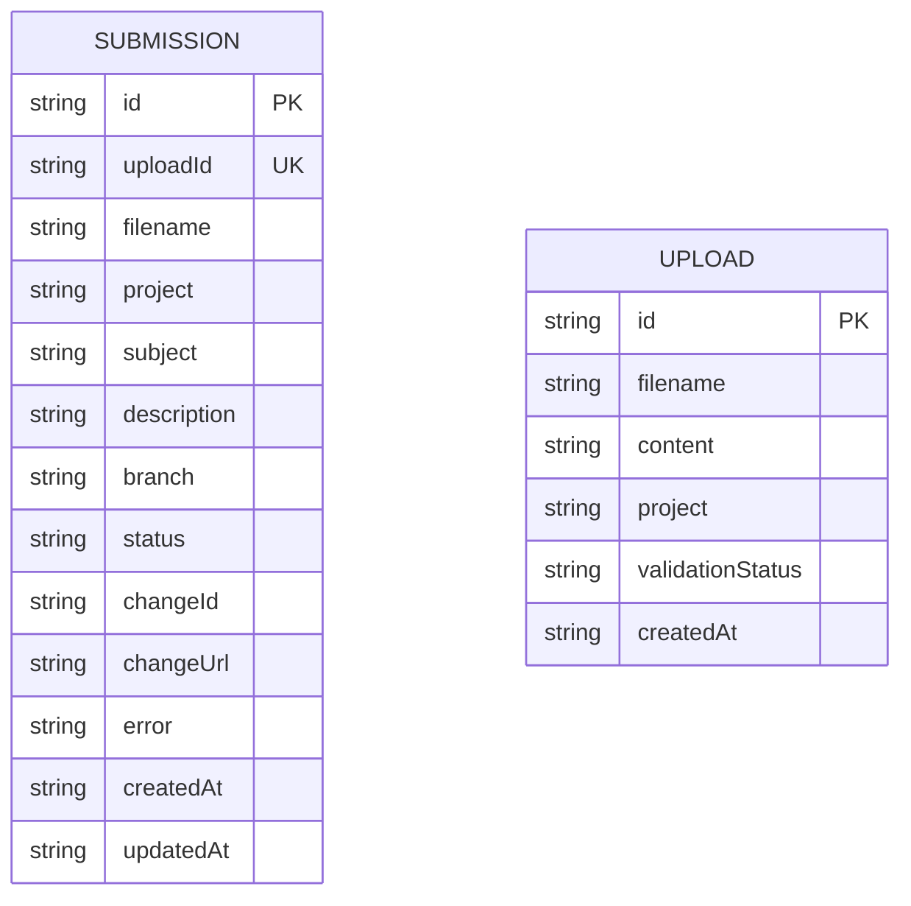

## 1. Architecture design



## 2. Technology Description
- **Frontend**: React@18 + TypeScript + Tailwind CSS
- **后端**: Cloudflare Workers + TypeScript
- **存储**: Cloudflare KV (键值存储)
- **部署**: Cloudflare Workers + Pages
- **API集成**: Google AOSP Gerrit REST API

## 3. Route definitions
| Route | Purpose |
|-------|---------|
| / | 首页，服务介绍和文件上传 |
| /submit | Patch提交页面，文件上传和表单填写 |
| /status/:id | 提交状态页面，显示处理进度和结果 |
| /history | 历史记录页面，查看过往提交 |
| /api/upload | Patch文件上传API |
| /api/submit | Patch提交到Gerrit的API |
| /api/status/:id | 查询提交状态API |

## 4. API definitions

### 4.1 文件上传API
```
POST /api/upload
```

Request:
| Param Name| Param Type  | isRequired  | Description |
|-----------|-------------|-------------|-------------|
| file      | File        | true        | Patch文件 (.patch或.diff) |
| project   | string      | true        | 目标AOSP项目名 |

Response:
| Param Name| Param Type  | Description |
|-----------|-------------|-------------|
| uploadId  | string      | 上传唯一标识 |
| status    | string      | 上传状态 |
| message   | string      | 状态说明 |

### 4.2 Patch提交API
```
POST /api/submit
```

Request:
| Param Name| Param Type  | isRequired  | Description |
|-----------|-------------|-------------|-------------|
| uploadId  | string      | true        | 文件上传ID |
| subject   | string      | true        | Commit主题 |
| description| string     | true        | 详细描述 |
| branch    | string      | true        | 目标分支 |

Response:
| Param Name| Param Type  | Description |
|-----------|-------------|-------------|
| changeId  | string      | Gerrit change ID |
| changeUrl | string      | Gerrit change链接 |
| status    | string      | 提交状态 |

### 4.3 状态查询API
```
GET /api/status/:id
```

Response:
| Param Name| Param Type  | Description |
|-----------|-------------|-------------|
| status    | string      | 当前状态 |
| changeId  | string      | Gerrit change ID |
| changeUrl | string      | Gerrit链接 |
| createdAt | string      | 创建时间 |
| error     | string      | 错误信息（如有） |

## 5. Server architecture diagram



## 6. Data model

### 6.1 数据模型定义


### 6.2 数据定义语言

**提交记录表 (submissions)**
```typescript
interface Submission {
  id: string;                    // 唯一标识
  uploadId: string;             // 关联上传ID
  filename: string;              // 原始文件名
  project: string;              // AOSP项目名
  subject: string;              // Commit主题
  description: string;          // 详细描述
  branch: string;               // 目标分支
  status: 'pending' | 'processing' | 'completed' | 'failed';
  changeId?: string;            // Gerrit change ID
  changeUrl?: string;           // Gerrit链接
  error?: string;               // 错误信息
  createdAt: string;            // 创建时间
  updatedAt: string;            // 更新时间
}
```

**上传文件表 (uploads)**
```typescript
interface Upload {
  id: string;                   // 唯一标识
  filename: string;             // 文件名
  content: string;              // 文件内容
  project: string;              // 目标项目
  validationStatus: 'valid' | 'invalid';
  validationError?: string;     // 验证错误
  createdAt: string;             // 创建时间
}
```

### 6.3 Cloudflare KV存储结构
```
# 命名空间配置
namespace: "aosp-patch-service"

# Key格式
submissions:{id} -> Submission对象
uploads:{id} -> Upload对象
status:{uploadId} -> 处理状态信息
```

### 6.4 安全配置
```typescript
interface SecurityConfig {
  maxFileSize: 10 * 1024 * 1024;      // 10MB
  allowedExtensions: ['.patch', '.diff'];
  rateLimit: {
    windowMs: 15 * 60 * 1000,          // 15分钟
    max: 10                             // 最多10次请求
  };
  cors: {
    origin: ['https://aosp-patch.example.com'],
    methods: ['GET', 'POST'],
    allowedHeaders: ['Content-Type', 'Authorization']
  };
}
```

## 7. 部署配置

### 7.1 wrangler.toml
```toml
name = "aosp-patch-service"
main = "src/index.ts"
compatibility_date = "2024-01-01"

[env.production]
kv_namespaces = [
  { binding = "AOSP_PATCH_KV", id = "production_kv_id" }
]

[env.staging]
kv_namespaces = [
  { binding = "AOSP_PATCH_KV", id = "staging_kv_id" }
]
```

### 7.2 环境变量
```bash
# Gerrit API配置
GERRIT_BASE_URL=https://android-review.googlesource.com
GERRIT_USERNAME=your-gerrit-username
GERRIT_PASSWORD=your-gerrit-password

# 服务配置
MAX_FILE_SIZE=10485760
RATE_LIMIT_WINDOW=900000
RATE_LIMIT_MAX=10
```